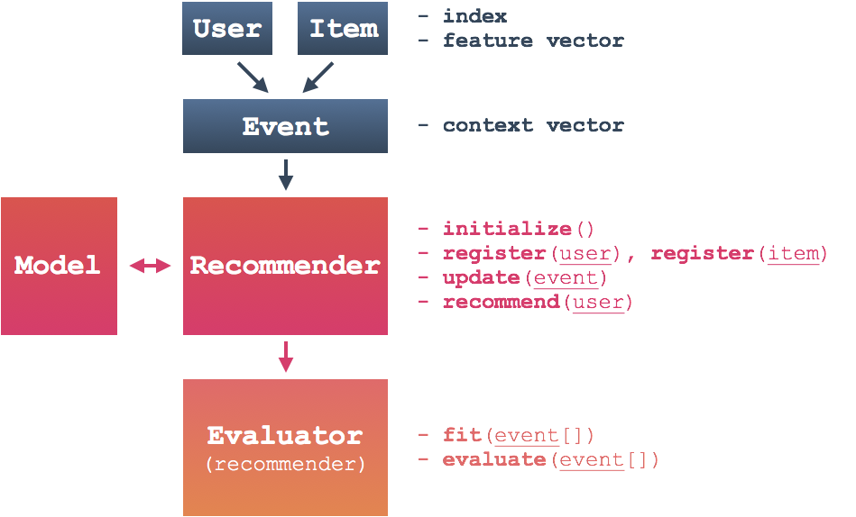

.. FluRS documentation master file, created by
   sphinx-quickstart on Tue Feb 20 07:03:57 2018.
   You can adapt this file completely to your liking, but it should at least
   contain the root `toctree` directive.

FluRS: Streaming Recommendation in Python
==========================================

This page documents **FluRS**, a Python library for streaming recommendation algorithms.

* `FluRS: A Library for Streaming Recommendation Algorithms <https://speakerdeck.com/takuti/flurs-a-library-for-streaming-recommendation-algorithms>`_ at `EuroSciPy 2017 <https://www.euroscipy.org/2017/>`_ (`video <https://www.youtube.com/watch?v=nARfsX63nDc>`_)
* `FluRS: A Python Library for Online Item Recommendation | takuti.me <https://takuti.me/note/flurs/>`_

Source code and installation can be found at: https://github.com/takuti/flurs

.. toctree::
   :maxdepth: 3

   tutorial
   reference
